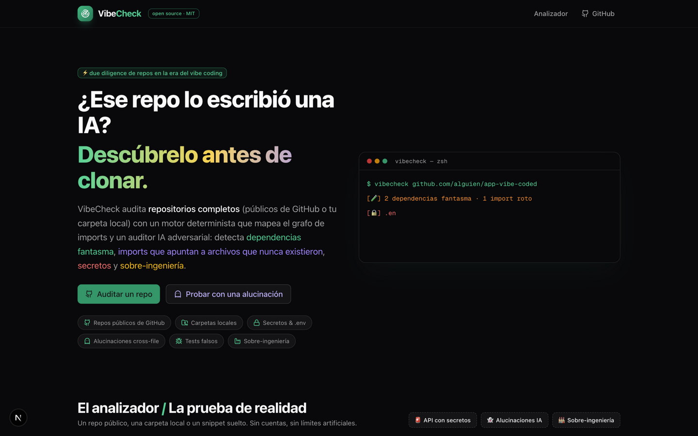
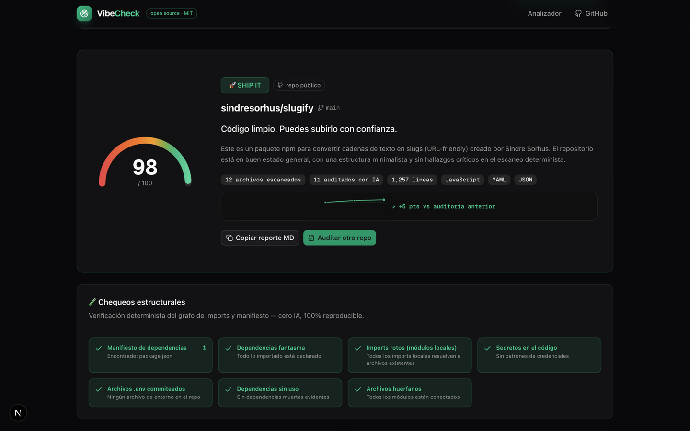
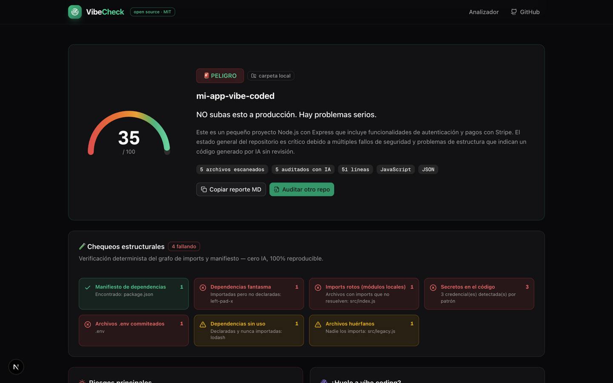

# VibeCheck

[](https://github.com/tiagofur/vibe-check/actions/workflows/ci.yml)
[](https://github.com/tiagofur/vibe-check/actions/workflows/self-audit.yml)
[](LICENSE)
[](https://nextjs.org)
[](tests)

[](https://www.buymeacoffee.com/tiagofur)

> **Due diligence adversarial para repositorios en la era del vibe coding.** ¿Ese repo lo escribió una IA a las 3 AM? Descúbrelo **antes de clonar**.
>
> **Antes de subirlo, hazle VibeCheck.**

[Read in English](README.md) · [Inicio rápido](#inicio-rápido) · [Documentación](#documentación) · [API](#api) · [Roadmap](#roadmap) · [Contribuir](#contribuir) · [Issues](https://github.com/tiagofur/vibe-check/issues)

VibeCheck audita **repositorios completos** — repos públicos de GitHub, carpetas locales o snippets sueltos — y produce un **Vibe Score 0-100** con veredicto: `SHIP IT 🚀` / `CASI LISTO 🟡` / `SOSPECHOSO 🤨` / `PELIGRO 🚨`.

A diferencia de los asistentes IA in-session (Claude Code, Cursor, Copilot) que revisan *su propio output cuando tú se lo pides*, VibeCheck hace **due diligence independiente**: no escribió el código, así que no tiene incentivo para defenderlo.

---

## Por qué existe

El vibe coding llegó para quedarse: la gente sube a producción código generado por IA sin revisión profunda. Los modos de falla son nuevos y específicos:

1. **Nadie hace due diligence antes de clonar.** Cuando tomas un boilerplate, un template, o compras una app "hecha con IA", nadie te entrega un informe de confianza independiente y adversarial del repo completo.
2. **Alucinaciones cross-file.** La IA llama `getUserById()` que **no existe en ningún archivo**, importa `./lib/auth` que nunca fue creado, o usa paquetes npm fantasma (slopsquatting). Detectar esto requiere el **grafo de imports de todo el repo** — ningún IDE lo hace sistemáticamente.
3. **Los chequeos estructurales no deben depender de un LLM.** Deps faltantes en `package.json`, imports rotos, `.env` commiteado, dependencias muertas, archivos huérfanos: esto debe ser **código verificable y reproducible**, no la opinión de un modelo.

VibeCheck está construido exactamente para ese hueco.

## Qué detecta

| Categoría | Peso | Ejemplos |
|---|---|---|
| 🔒 Seguridad | 0.30 | Secretos hardcodeados, `.env` commiteado, inyección SQL/XSS, endpoints sin auth |
| 👻 Alucinaciones | 0.30 | Imports de paquetes inexistentes, APIs inventadas, llamadas a módulos que nunca se crearon |
| 🐛 Bugs | 0.25 | Off-by-one, null sin manejar, race conditions, **tests falsos** (que no pueden fallar) |
| 🏭 Sobre-ingeniería | 0.15 | Abstracciones injustificadas, código muerto, deps sin uso, archivos huérfanos |

Además, un **motor determinista** (100% reproducible, cero LLM) verifica los chequeos estructurales: grafo de imports vs. manifiesto (incluyendo **aliases de tsconfig/jsconfig**), dependencias fantasma, imports rotos, secretos por patrón, `.env` commiteado, deps muertas y archivos que nadie importa. También trae un **detector de tests falsos**: suites que no pueden fallar (cero asserts), assertions tautológicas (`expect(true).toBe(true)`), cuerpos de test vacíos y tests saltados — en JS/TS y Python.

Y cada score viene con su recibo: el desglose **"¿Por qué N/100?"** muestra cuántos puntos costó cada grupo de hallazgos (severidad × peso de categoría) y si se aplicó algún techo duro.

## Cómo funciona

1. **Descarga + grafo de imports** — recorre el árbol del repo (tarball de GitHub, sin API keys) y construye el grafo de imports contra el manifiesto. Determinista y verificable.
2. **Triage adversarial** — los archivos se rankean por riesgo (auth > pagos > secretos > DB > API) y los ~30 más calientes se auditan a fondo con IA en lotes, cazando alucinaciones cross-file y tests falsos.
3. **Veredicto con evidencia** — hallazgos con archivo, línea y fix sugerido; señales de vibe coding; y un score determinista con **techo duro**: un crítico de seguridad o alucinación clava el score en ≤35 (PELIGRO).

## Capturas

| Portada — el analizador | Un repo sano | Un repo vibe-coded |
|---|---|---|
|  |  |  |

Auditorías reales: `sindresorhus/slugify` puntúa **98/100 SHIP IT** (fíjate en la sparkline de tendencia: ↗ +5 pts vs la auditoría anterior), mientras que una carpeta sintética vibe-coded puntúa **35/100 PELIGRO** con cada defecto plantado detectado — dependencia fantasma, import roto, 3 secretos, `.env` commiteado, dep muerta y un archivo huérfano.

---

## Documentación

### Modos

- **🐙 Repo de GitHub** — los públicos funcionan sin configurar nada. Privados: pega un Personal Access Token (scope `repo`) por auditoría — nunca se guarda — o define `GITHUB_TOKEN` en el servidor.
- **📁 Carpeta local** — arrastra y suelta o elige una carpeta; corre el mismo pipeline.
- **✂️ Snippet** — pega código para una auditoría rápida.
- **🔀 Modo diff** — el gate de regresión. Escribe un ref base (tag/rama/sha) y VibeCheck descarga ambos árboles, los difuye, y **audita y puntúa solo los archivos cambiados**. Los hallazgos pre-existentes se excluyen del score y se cuentan. Perfecto para PRs.
- **📈 Tendencia** — cada auditoría completa alimenta una serie histórica por repo: el reporte muestra una sparkline con la evolución y el delta contra la auditoría anterior (`↗ +5 pts`), y el badge incluye la flecha de tendencia. Los audits en modo diff se excluyen de la tendencia (puntúan cambios, no el repo).
- **🔥 Modo roast** — el reporte serio se queda serio. Dale a "Modo roast" (web) o `--roast` (CLI) para un resumen sarcástico, determinista y compartible del daño. Mismo repo, mismo roast — es reproducible como todo lo demás aquí.

### Inicio rápido

Requisitos: [Bun](https://bun.sh) (o Node 20+) y credenciales de `z-ai-web-dev-sdk` para el backend de IA.

```bash
git clone https://github.com/tiagofur/vibe-check.git
cd vibe-check
bun install

# entorno
cp .env.example .env

# base de datos (historial de auditorías)
bun run db:generate && bun run db:push

# http://localhost:3000
bun run dev
```

> El SDK de IA (`z-ai-web-dev-sdk`) se configura según su propia documentación (archivo `.z-ai-config`); nunca se usa en el cliente. El motor determinista y el CLI funcionan sin él.

| Comando | Qué hace |
|---|---|
| `bun run dev` | Servidor de desarrollo en :3000 |
| `bun run build` / `bun run start` | Build standalone de producción / arranque |
| `bun run lint` / `bun run typecheck` | ESLint / `tsc --noEmit` |
| `bun run test` / `bun run test:watch` | Suite de tests del motor (Vitest) |
| `bun run db:push` / `db:generate` | Sincroniza el schema Prisma / regenera el cliente |

### CLI: audita sin servidor

El motor determinista corre local — sin servidor, sin LLM, sin base de datos:

```bash
bun cli.ts ./mi-proyecto            # reporte legible
bun cli.ts ./mi-proyecto --json     # salida para CI (incluye scoreExplanation + roast)
bun cli.ts ./mi-proyecto --roast    # añade la sección 🔥 roast
bun cli.ts . --exclude tests        # excluye rutas (repetible)
echo $?                             # 1 si el veredicto es SOSPECHOSO o PELIGRO → gate de CI
```

### API

| Endpoint | Descripción |
|---|---|
| `POST /api/analyze` | Audita un snippet `{ code, language?, title? }` · 20 req/h por IP |
| `POST /api/analyze-repo` | Audita un repo o carpeta · 10 req/h por IP · con `Accept: text/event-stream` responde NDJSON con progreso real (`{type:'progress', phase, pct, message}` → `{type:'done'}`) |
| `GET /api/checks` · `/[id]` · `DELETE` | Historial / detalle / borrado de snippets |
| `GET /api/repo-checks` · `/[id]` · `DELETE` | Historial / detalle / borrado de repos |
| `GET /api/repo-trend?repo=owner/name` | Serie temporal del score (excluye audits en modo diff) |
| `GET /api/badge/[owner]/[repo].svg` | Badge SVG con el último Vibe Score + flecha de tendencia (nunca 404) |

**Caché por contenido**: cada versión de un repo se audita una única vez — la clave es el sha256 del tarball descargado (o de la carpeta). Re-auditar un repo sin cambios responde al instante, sin quemar créditos de LLM.

### VibeCheck en tus Pull Requests

Copia [`docs/vibecheck-action.yml`](docs/vibecheck-action.yml) a `.github/workflows/vibecheck.yml` en cualquier repo, define el secret `VIBECHECK_URL` apuntando a tu instancia, y cada PR recibirá un comentario con su Vibe Score, el desglose de "¿por qué este score?" y el badge.

- **Modo diff integrado**: el workflow audita el head del PR contra `github.event.pull_request.base.sha`, así que el score refleja solo lo que cambió el PR.
- **Quality gate**: define la variable de repo `VIBECHECK_MIN_SCORE` (default `60`) y el job falla cuando el score queda por debajo.

### VibeCheck audita a VibeCheck

El mejor dogfooding es auditar al auditor. Cada push a `main` corre el CLI determinista sobre el propio código fuente de este repo y publica el score, el desglose punto por punto y el roast en el [resumen del job](https://github.com/tiagofur/vibe-check/actions/workflows/self-audit.yml).

Dos exclusiones, a propósito y a la vista: `tests/` (el fixture versionado planta defectos a propósito) y `src/lib/samples.ts` (snippets de ejemplo con secretos falsos — el scanner los detecta, que es justo el punto).

### Badge en tu README

Después de auditar un repo en tu instancia:

```markdown

```

### Privacy by design

Los contenidos de los archivos auditados **nunca se persisten** — solo el reporte (scores, hallazgos, metadatos) queda en tu instancia. Los snippets pegados tampoco se guardan.

### Límites honestos

- Repos >40 MB comprimidos no soportados; hasta 120 archivos leídos por corrida (el grafo corre sobre el árbol completo).
- El modo diff apunta a repos de tamaño PR; con más de 120 archivos escaneables el diff es aproximado.
- Los hallazgos IA pueden contener errores: **no sustituyen una code review humana**. Los deterministas (`origin: scan`) son reproducibles.
- El rate limiting es en memoria por instancia (sustitúyelo por Redis si escalas).

## Estado del proyecto

**v0.1.0** — funcional y en desarrollo activo. Nació como proyecto vibe-coded, se auto-auditó y se endureció paso a paso: build limpio (sin errores de tipos ignorados), 75 tests con un fixture "vibe-coded" versionado, CI en cada push, rate limiting, caché por contenido, progreso real en streaming, modo diff, repos privados, CLI local, tendencias históricas, score explicable, detector determinista de tests falsos y modo roast.

## Roadmap

- [ ] OAuth de GitHub (tokens por sesión en vez de pegar PATs)
- [ ] Modo diff para carpetas locales (contra un snapshot guardado)
- [ ] Publicar el CLI en npm (`npx vibecheck`)
- [ ] Atribución de score en tendencias ("los cambios desde v1.2 te costaron 12 puntos")

## Contribuir

El mejor dogfooding es auditar al auditor: clona, corre `bun run lint && bun run typecheck && bun run test` y lee [`src/lib/repo-scan.ts`](src/lib/repo-scan.ts) — el motor determinista es puro y fácil de extender con nuevos chequeos.

El flujo para un chequeo nuevo: **planta primero el defecto** en [`tests/fixtures/vibe-coded-repo/`](tests/fixtures/vibe-coded-repo) (un mini-repo vibe-coded con defectos intencionales), y luego haz que el motor lo detecte. La suite exige que cada defecto plantado sea detectado y que no aparezca ningún falso positivo.

## Apoya el proyecto

Si VibeCheck te salvó de clonar (o subir) un desastre de IA, considéralo:

[](https://www.buymeacoffee.com/tiagofur)

## Licencia

[MIT](LICENSE) — hecho con 💚 para la comunidad dev.
